# DHBW Chat

Eine sichere Chat-Anwendung für Studierende der Dualen Hochschule Baden-Württemberg (DHBW), entwickelt von Studierenden für Studierende.

## Überblick

DHBW Chat ist eine webbasierte Kommunikationsplattform mit Fokus auf Datenschutz und Benutzerfreundlichkeit. Die Anwendung ermöglicht Direktnachrichten, Gruppenchats und einen globalen Chat.

### Hauptmerkmale

- **Globaler Chat** – Campus-weiter Austausch über alle Standorte
- **Gruppenchats** – Private Lerngruppen und Projektteams
- **Responsive Design** – Optimiert für Desktop und Mobile
- **Datenschutzkonform** – Minimale Datenspeicherung, DSGVO-konform

## Technologie-Stack

| Komponente | Technologie |
|------------|-------------|
| Backend | PHP 8.x |
| Datenbank | MySQL |
| Frontend | HTML5, CSS3, JavaScript |
| Server | Apache (XAMPP) |
| Fonts | Rubik, Exo2 |

## Installation

### Voraussetzungen

- PHP 8.0 oder höher
- MySQL 5.7+
- Apache Webserver (oder XAMPP/MAMP)
- PDO MySQL Extension

### Einrichtung

### 1. XAMPP herunterladen und starten

1. Neueste Version von XAMPP herunterladen:  
   https://www.apachefriends.org/de/download.html
2. Das XAMPP Control Panel ausführen.
3. Den Service **„Apache“** starten.
4. Den Service **„MySQL“** starten (ggf. als Admin bestätigen).

### 2. phpMyAdmin öffnen

- Klick auf **„Admin“** bei MySQL im XAMPP Control Panel.

### 3. Neues Benutzerkonto mit Datenbank anlegen

Unter **Benutzerkonten → Benutzerkonto hinzufügen** folgende Daten eintragen:

- **Benutzername:** `web-eng_dhbw-chat`  
- **Hostname:** beliebig / lokal (`127.0.0.1`)  
- **Passwort:** `chat`  
- **Option aktivieren:** „Erstelle eine Datenbank mit gleichem Namen und gewähre alle Rechte.“

Dadurch entstehen:

- **Datenbankname:** `web-eng_dhbw-chat`  
- **Benutzername:** `web-eng_dhbw-chat`  
- **Passwort:** `chat`  

### 4. Datenbankschema importieren

1. Die neu erstellte Datenbank links auswählen.
2. Oben den Reiter **„SQL“** anklicken.
3. Dateiinhalt von `src/sql/schema.sql` kopieren.
4. In die SQL-Befehls-Eingabemaske einfügen.
5. Mit **OK** ausführen.

### 5. Datenbankverbindung konfigurieren

In `components/db_connect.php` eintragen:

```php
$pdo = new PDO(
    'mysql:host=127.0.0.1;dbname=web-eng_dhbw-chat;charset=utf8mb4',
    'web-eng_dhbw-chat',
    'chat'
);
```

# Tutorial

## Inhaltsverzeichnis
1. [Registrierung und Anmeldung](#registrierung-und-anmeldung)
2. [Nachrichten senden](#nachrichten-senden)
3. [Kontakt hinzufügen](#kontakt-hinzufügen)
4. [Gruppe erstellen](#gruppe-erstellen)
5. [Profil bearbeiten](#profil-bearbeiten)
6. [Abmelden](#abmelden)

---

## Registrierung und Anmeldung

### Registrierung

1. Klicke auf **"Jetzt loslegen"** oder **"Account erstellen"**
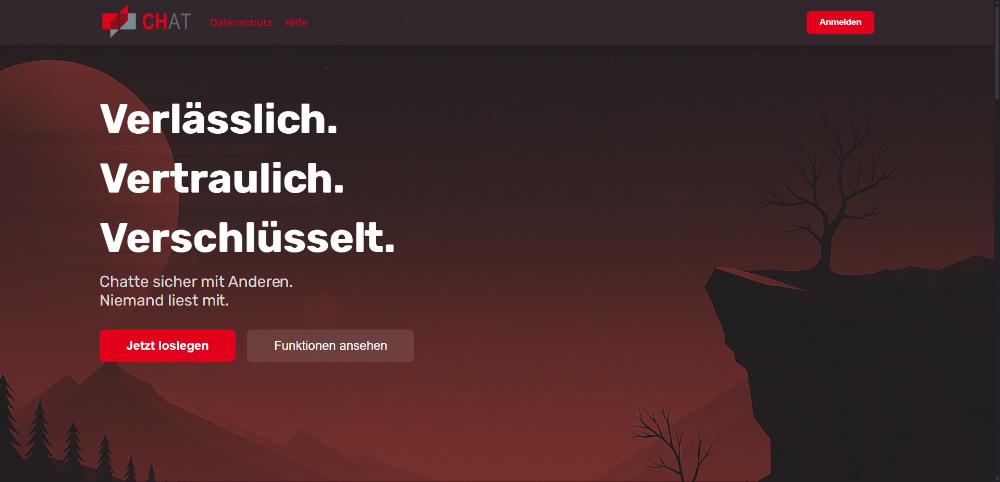

2. Gib deine Daten ein:
    - **Benutzername** (nur Buchstaben und Zahlen, max. 30 Zeichen)
    - **DHBW E-Mail-Adresse**
    - **Fakultät, Studiengang und Studienjahr** wählen
3. Klicke auf **"Weiter"**
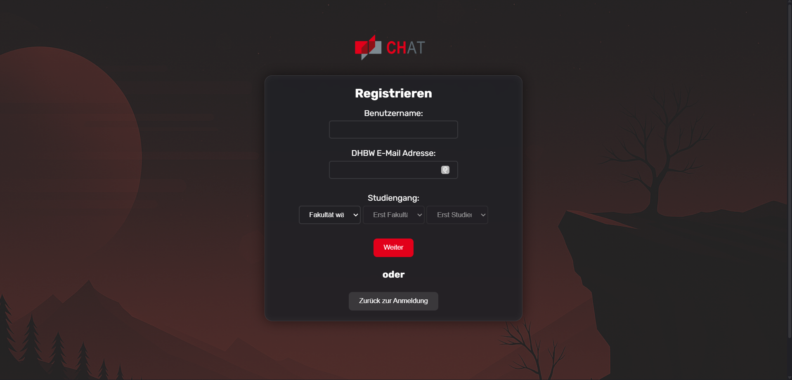

4. Lege dein **Passwort** fest (mindestens 6 Zeichen)
5. Wiederhole das Passwort
6. Klicke auf **"Registrieren"**
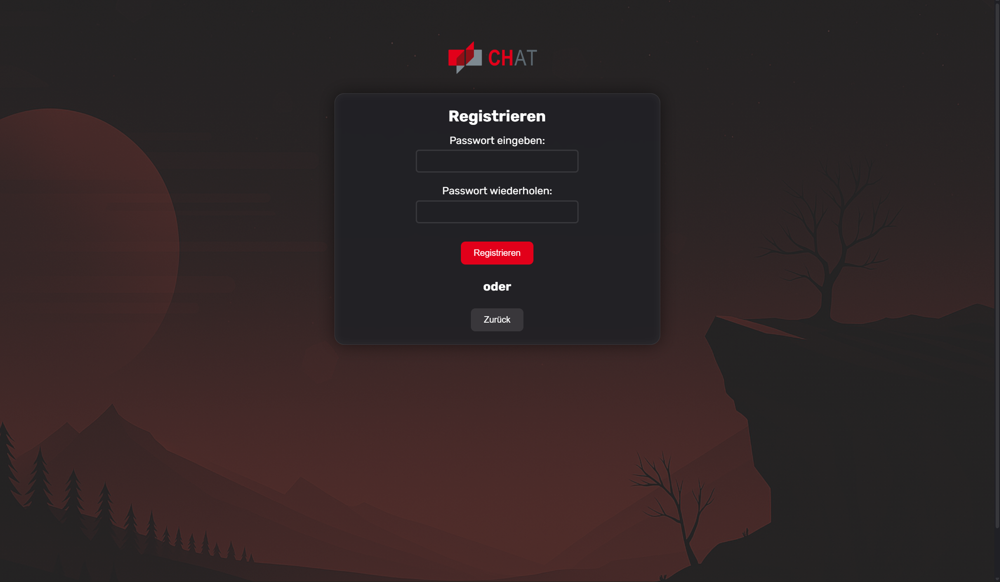

✅ Du wirst automatisch eingeloggt und dem globalen Chat hinzugefügt.

### Anmeldung

1. Öffne die Login-Seite
2. Gib deinen **Benutzernamen** ein (nicht die E-Mail!)
3. Gib dein **Passwort** ein
4. Klicke auf **"Anmelden"**


## Nachrichten senden

### Chat auswählen

1. In der **linken Seitenleiste** siehst du alle verfügbaren Chats
2. **Klicke auf einen Chat**, um ihn zu öffnen
3. Der Nachrichtenverlauf wird angezeigt
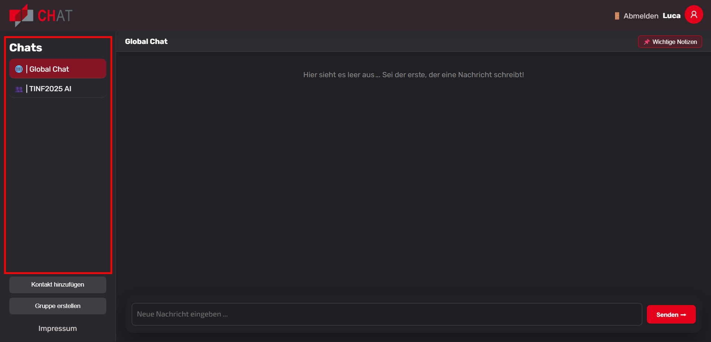

### Nachricht schreiben

1. Klicke in das **Eingabefeld** am unteren Rand
2. Tippe deine Nachricht
3. Drücke **Enter** oder klicke auf **"Senden"**
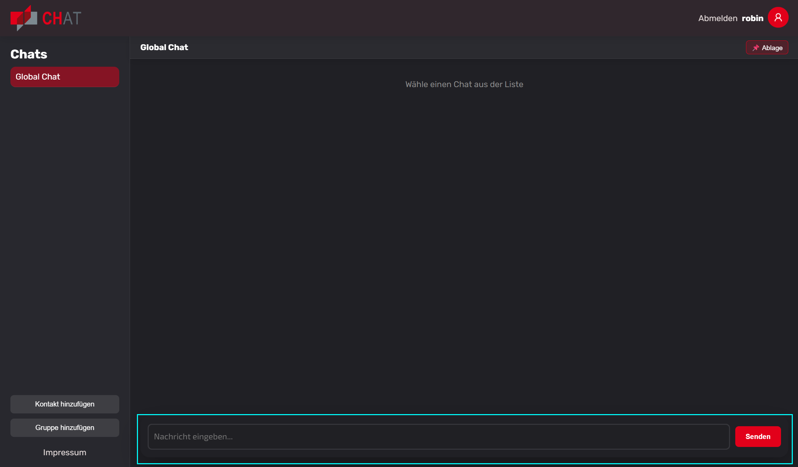

## Kontakt hinzufügen

1. Klicke in der Chat-Liste auf **"Kontakt hinzufügen"**
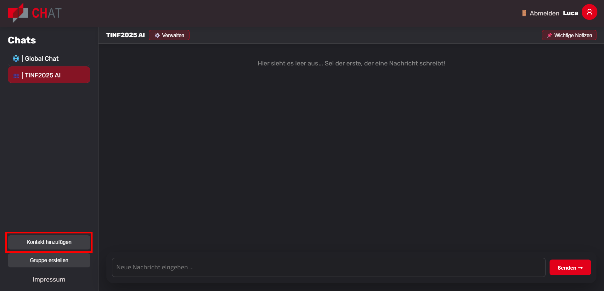
2. Gib den **Benutzernamen** oder die **E-Mail-Adresse** ein
3. Klicke auf **"Hinzufügen"**
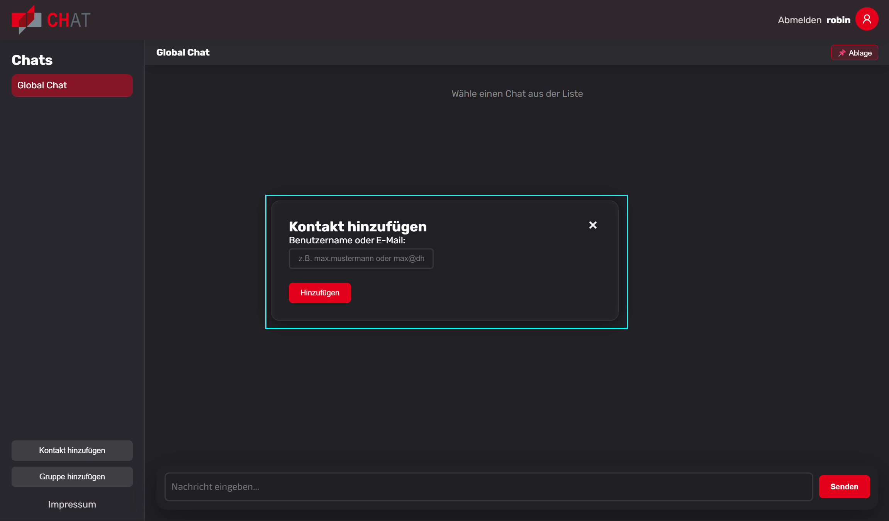

✅ Der Kontakt erscheint in deiner Chat-Liste.

## Gruppe erstellen

1. Klicke in der Chat-Liste auf **"Gruppe hinzufügen"**
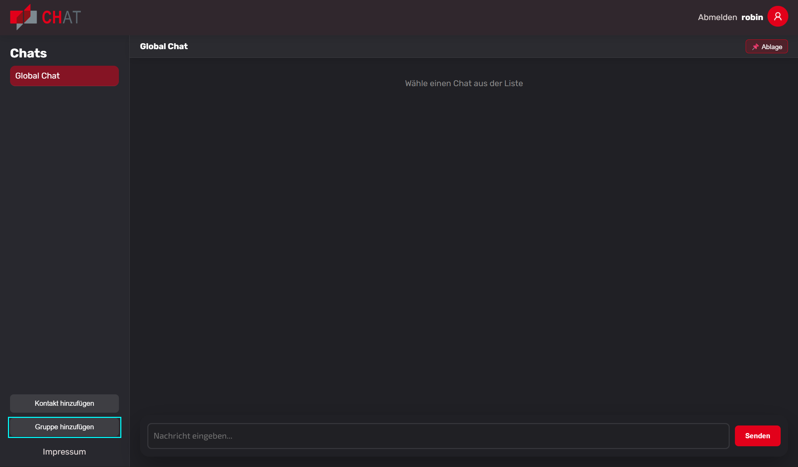
2. Gib einen **Gruppennamen** ein
3. Füge Mitglieder hinzu:
    - Gib einen **Benutzernamen** oder **E-Mail** ein
    - Klicke auf **"+ Hinzufügen"**
    - Wiederhole dies für weitere Mitglieder
4. Klicke auf **"Gruppe erstellen"**
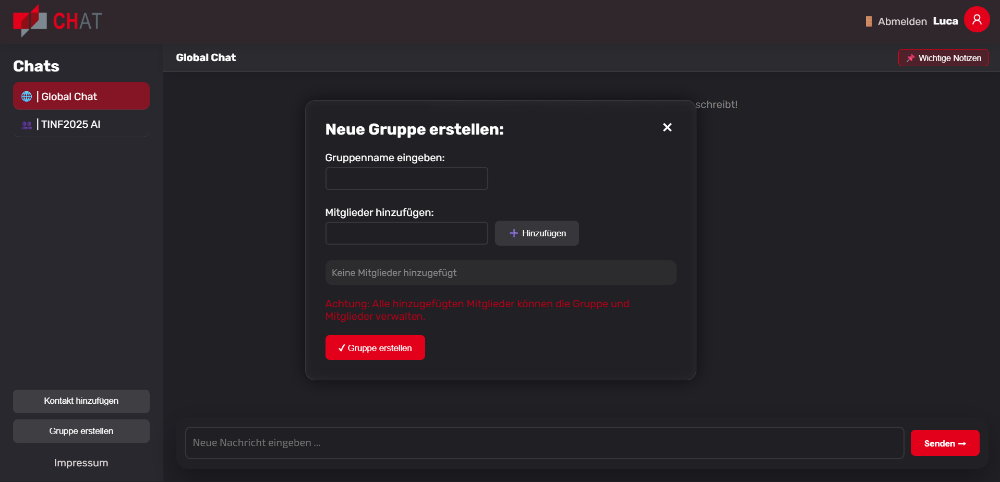

✅ Die neue Gruppe erscheint in deiner Chat-Liste.

### Mitglieder später hinzufügen

1. Öffne den Gruppenchat
2. Klicke oben links auf **"+ Mitglied"**
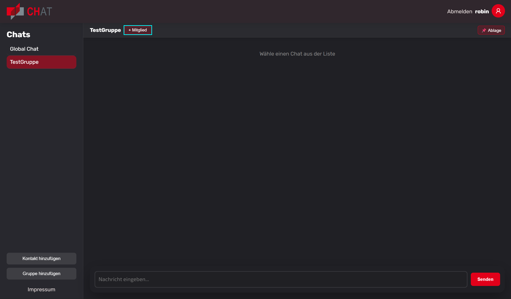
3. Gib Benutzername oder E-Mail ein
4. Klicke auf **"+ Hinzufügen"**
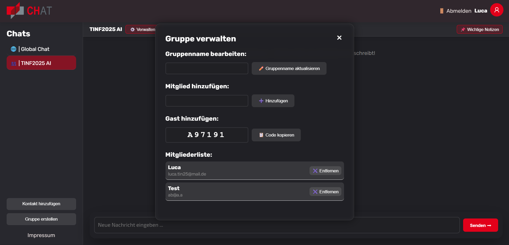

## Profil bearbeiten

### Einstellungen öffnen

Klicke oben rechts auf dein **Profilbild** oder deinen **Benutzernamen**.
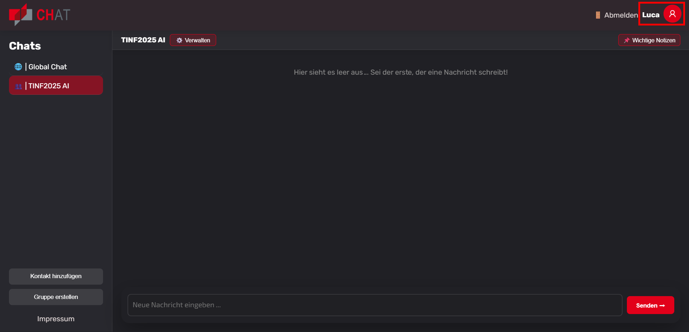

### Benutzername ändern

Klicke bei **"Username"** auf **"Bearbeiten"**
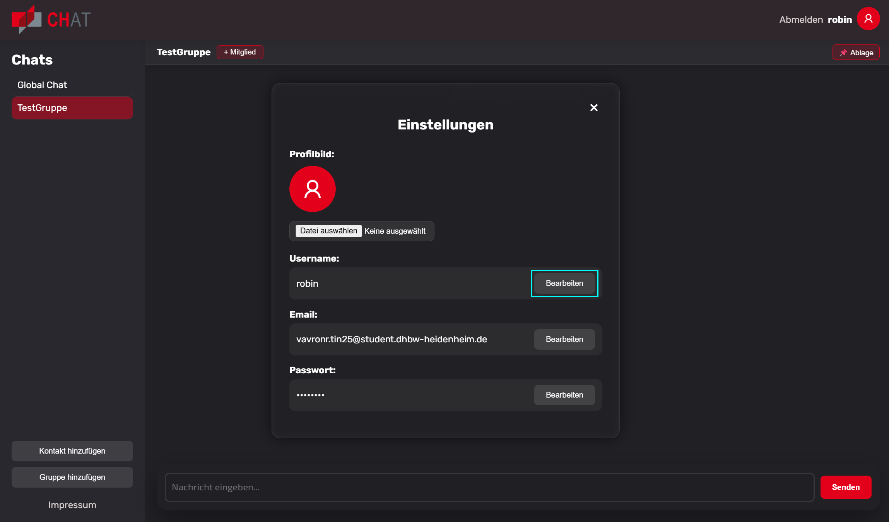

### E-Mail-Adresse ändern

Klicke bei **"Email"** auf **"Bearbeiten"**
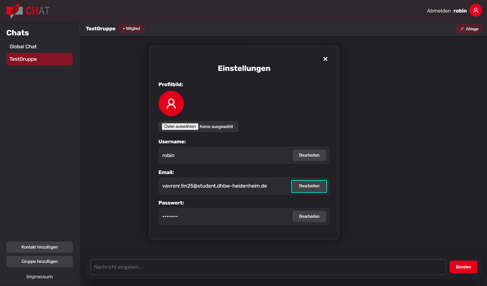

### Passwort ändern

Klicke bei **"Passwort"** auf **"Bearbeiten"**
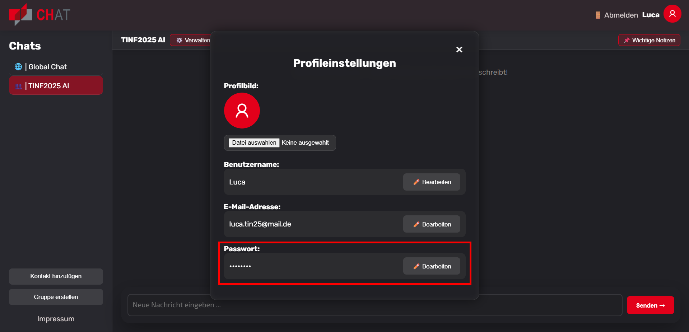

## Abmelden

1. Klicke oben rechts auf **"Abmelden"**
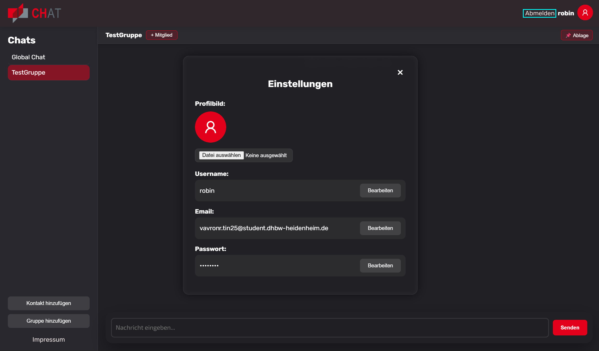
2. Du wirst automatisch ausgeloggt
3. Weiterleitung zur Startseite erfolgt nach 2 Sekunden

---

## CSS-Architektur

Die Anwendung verwendet CSS Custom Properties für konsistentes Theming:

```css
:root {
    --primary-color: #FFFFFF;
    --primary-background-color: #202025;
    --primary-button-color: rgba(226,0,26,1);
    --error-color: #B50015;
    /* ... */
}
```

### Utility-Klassen

| Klasse | Beschreibung |
|--------|--------------|
| `.margin-top-X` | Oberer Abstand (1-10) |
| `.padding-X` | Innenabstand (1-5) |
| `.align-center` | Zentrierter Text |
| `.style-bold` | Fettschrift |
| `.background` | Sekundäre Hintergrundfarbe |

## Sicherheit

- **Session-Management**: Sichere Session-Handling mit `session_start()`
- **Input-Validierung**: Serverseitige Validierung aller Benutzereingaben
- **Prepared Statements**: PDO mit parametrisierten Queries gegen SQL-Injection
- **XSS-Schutz**: Output-Encoding mit `htmlspecialchars()`
- **IP-Logging**: Temporäre Speicherung (max. 24h) zur Missbrauchsprävention

### Datenbanktest

Die Datei `test.php` prüft die PHP-Konfiguration und Datenbankverbindung.

## Mitwirkende

Entwickelt im Rahmen eines DHBW-Projekts.

## Lizenz

Dieses Projekt ist für Bildungszwecke an der DHBW entwickelt worden.
